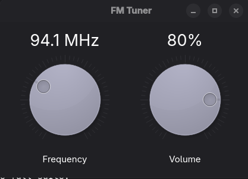
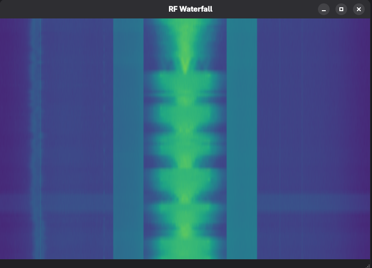
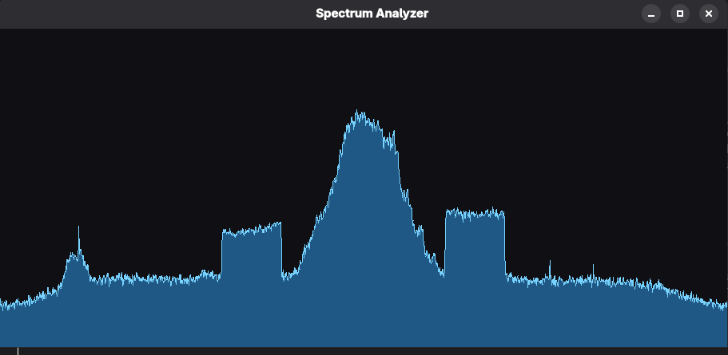
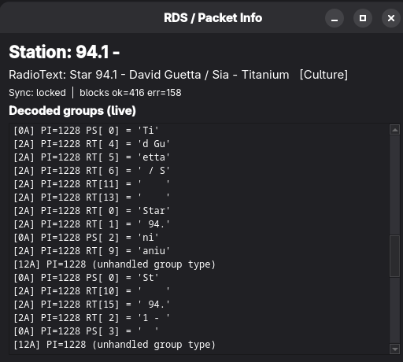

# Python FM SDR

## FM TUNER

## RF Waterfall diagram

## Spectrum Analyzer

## RDS Packet Info

## Standard FM broadcast max frequency devication
    MAX_DEVIATION_HZ = 75_000
    FULL_SCALE_RAD_PER_SAMPLE = 2 * pi * MAX_DEVIATION / SDR_SAMPLE_RATE
